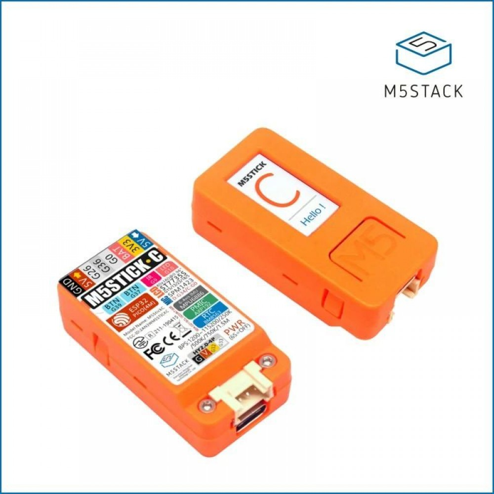
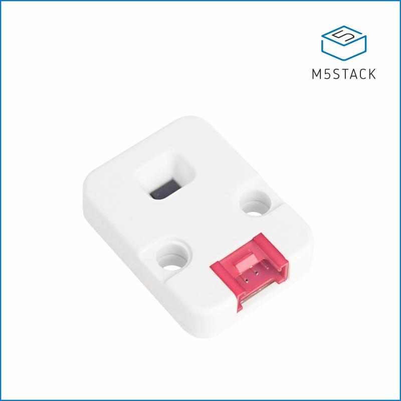

# DistIRVL53L0X

## 1. Sensor VL53L0X e M5StickC com MicroPython

### 1.1 M5StickC

[M5StickC](https://m5stack.com/products/stick-c) é uma placa de desenvolvimento de IoT portátil compacta e com bom acabamento, alimentado por ESP32, fácil de usar e de código aberto.



### 1.2 Sensor VL53L0X

[Unidade de sensor de alcance de distância de tempo de voo (VL53L0X)](https://m5stack.com/products/tof-sensor-unit?_pos=2&_sid=c49bf723d&_ss=r) determina a distância entre o ponto de emissão e o ponto de alcance de dado material/objeto, etc, medindo o tempo de ida e volta de um sinal fornecido por feixe à laser.

A referida unidade apresenta alta precisão nas medições de distância até 2 m, comprimento de onda do feixe de 940 nm e pode ser operado em plataformas diversas, como por exemplo, [Arduino IDE](https://docs.m5stack.com/#/en/arduino/arduino_home_page), [UIFlow (Blockly, Python)](https://m5stack.com/pages/uiflow).



## 2. Exemplo de código-fonte para realizar leituras de distâncias

```python
from m5stack import lcd
from m5ui import M5TextBox, M5Title, setScreenColor
from uiflow import wait_ms
import time
import unit

lcd.clear()
lcd.setRotation(3)
distfield = M5TextBox(40, 20, "0", lcd.FONT_DejaVu40, 0x08feab)
mmlabel = M5TextBox(70, 64, "+/- 3 mm", lcd.FONT_Default, 0xFFFFFF)
distlabel = M5TextBox(0, 0, "M5Stick VL53L0X Unit", lcd.FONT_Small, 0xFFFFFF)

tof = unit.get(unit.TOF, unit.PORTA)

while True:
    distfield.setText(str(tof.distance))
    delta_tof = 1 + (tof.distance*3//100)
    mmlabel.setText("+/- " + str(delta_tof) + " mm")
    print('(' + str(tof.distance) + " +/- " + str(delta_tof) + ") mm")
    wait_ms(75)
```

## 3. Leituras de distâncias com DistIRVL53L0X (VL53L0X + M5StickC)

'rshell -p /dev/ttyUSB0' para acessar as funções do sistema

```
(base) thiagofe@thiagofe-ubuntu:~/Downloads/VL53L0X/M5StickC-UIFlow-VL53L0X$ rshell -p /dev/ttyUSB0
Using buffer-size of 32
Connecting to /dev/ttyUSB0 (buffer-size 32)...
Trying to connect to REPL  connected
Testing if ubinascii.unhexlify exists ... Y
Retrieving root directories ... /flash/
Setting time ... Sep 04, 2020 14:12:17
Evaluating board_name ... pyboard
Retrieving time epoch ... Jan 01, 2000
Welcome to rshell. Use Control-D (or the exit command) to exit rshell.
```

'repl' (modo interativo) para receber entradas de usuário único 

```
/home/thiagofe/Downloads/VL53L0X/M5StickC-UIFlow-VL53L0X> repl
Entering REPL. Use Control-X to exit.
>
```

Use a combinação de teclas 'Ctrl + D' ou pressione uma única vez o botão laterial esquerdo para dar 'soft reboot'

```
MicroPython v1.11-321-gac7da0a70-dirty on 2020-02-25; ESP32 module with ESP32
Type "help()" for more information.
>>> 
>>> 
MPY: soft reboot
[ M5 ] node id:d8a01d5148f0, api key:7740E568
(0 +/- 1) mm
(0 +/- 1) mm
(49 +/- 2) mm
(50 +/- 2) mm
(50 +/- 2) mm
(55 +/- 2) mm
(52 +/- 2) mm
(51 +/- 2) mm
(51 +/- 2) mm
(53 +/- 2) mm
(51 +/- 2) mm
...
```
